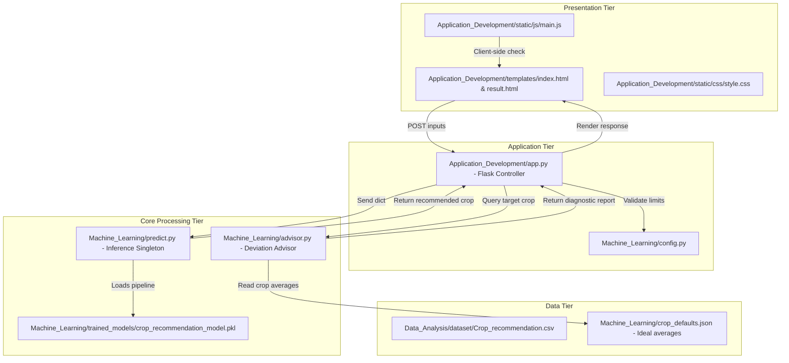

# System Architecture & Data Schema Documentation

This document describes the software layers, data flows, and entity relations of the **Smart Agricultural Production Optimization Engine (OptiCrop)**.

---

## 1. System Architecture Diagram

OptiCrop is designed using a modular, multi-tier architecture to support team division and software extensibility:

### Architectural Tiers:
1.  **Presentation Tier:** Contains HTML5 structures, CSS styles, and JavaScript controls. Renders fully responsive interfaces for the user.
2.  **Application Tier:** Built on Flask. Provides request-response routing, session management, and server-side range limit validations.
3.  **Core Processing Tier:** Integrates model loading and execution (`predict.py`) with agricultural rules (`advisor.py`) to yield optimized recommendations.
4.  **Data Tier:** Contains the primary CSV dataset and cached crop averages to speed up performance.

---

## 2. Soil & Climate Entity Profiling (Schema)

Although OptiCrop uses a flat-file database format (CSV) for training and JSON for default averages, the internal data elements represent a **Soil & Climate Profile** entity:

| Attribute | Type | Description | Operational Boundary | Unit |
| :--- | :--- | :--- | :--- | :--- |
| **N** | Integer | Ratio of Nitrogen content in soil | 0 - 150 | mg/kg |
| **P** | Integer | Ratio of Phosphorus content in soil | 5 - 145 | mg/kg |
| **K** | Integer | Ratio of Potassium content in soil | 5 - 205 | mg/kg |
| **temperature** | Float | Environmental ambient temperature | 0.0 - 50.0 | °C |
| **humidity** | Float | Relative humidity level | 10.0 - 100.0 | % |
| **ph** | Float | pH value of the soil (acidity/alkalinity) | 3.5 - 10.0 | pH scale |
| **rainfall** | Float | Volume of average rainfall | 20.0 - 300.0 | mm |
| **label** | String | Crop type identifier (Predicted target) | 22 crop classes | text |

---

## 3. Data Flows

1.  **Data Analysis & Training Flow:**
    `Crop_recommendation.csv` $\rightarrow$ `exploratory_analysis.py` $\rightarrow$ yields statistics, EDA plots, and `crop_defaults.json`.
    `Crop_recommendation.csv` $\rightarrow$ `train.py` $\rightarrow$ trains scikit-learn pipeline $\rightarrow$ outputs `crop_recommendation_model.pkl`.
2.  **Inference & Optimization Flow:**
    User inputs soil levels $\rightarrow$ Flask validates ranges $\rightarrow$ ML predicts ideal crop matching $\rightarrow$ advisor calculates offsets against `crop_defaults.json` $\rightarrow$ outputs custom guidance cards.
