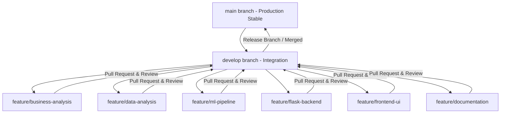

# OptiCrop Project: Git Branching Strategy & Workflow Guide

To ensure high-quality software engineering practices and seamless collaboration among our 5-member team, all developers must adhere to the following git workflow rules.

---

## 1. Branching Strategy

Our repository uses a modified **GitFlow** branching strategy. No developer is allowed to commit directly to `main` or `develop`.

### Core Branches
*   **`main`**: Represents the production-ready state. Only Team Leader (**K Lohitha**) is authorized to merge release branches into `main` after integration testing.
*   **`develop`**: The primary integration branch where features are combined and tested.

### Feature Branches
Features are developed on independent branches named as:
`feature/<feature-name>`

Examples:
*   `feature/business-analysis` (Assigned to: **Jahnavi Dunthala**)
*   `feature/data-analysis` (Assigned to: **Gondinigari Sneha**)
*   `feature/ml-pipeline` (Assigned to: **Kalagotla Fathima**)
*   `feature/flask-backend` (Assigned to: **Dhanireddy Sirisha**)
*   `feature/frontend-ui` (Assigned to: **Dhanireddy Sirisha** & **K Lohitha**)
*   `feature/documentation` (Assigned to: **Documentation Team**)

---

## 2. Commit Message Convention

Commits must follow the **Conventional Commits** style to maintain a clear history:
`<type>(<scope>): <short description>`

*   **`feat`**: A new feature (e.g. `feat(ml): implement Random Forest model pipeline`)
*   **`fix`**: A bug fix (e.g. `fix(backend): correct float range validation for pH values`)
*   **`docs`**: Documentation edits (e.g. `docs(workflow): add git branch rules`)
*   **`style`**: Formatting, CSS adjustments (e.g. `style(ui): apply glassmorphic box shadow glow`)
*   **`refactor`**: Code changes that neither fix bugs nor add features (e.g. `refactor(engine): cache crop defaults JSON`)

---

## 3. Pull Request (PR) & Code Review Checklist

Before any branch is merged into `develop` or `main`:
1.  **Local Verification**: Run all unit tests (`pytest`) locally and ensure they pass.
2.  **Lint Check**: Ensure Python files follow PEP 8 and JavaScript files are clean.
3.  **Open a PR**: Address the PR description to explain *what* changes were made, *why*, and *how* they were verified.
4.  **Assigned Reviewers**: Assign at least 1 peer reviewer (e.g. K Lohitha or an expert on that module).
5.  **Merge Rule**: Merging is only permitted after code approval and when CI checks pass.
